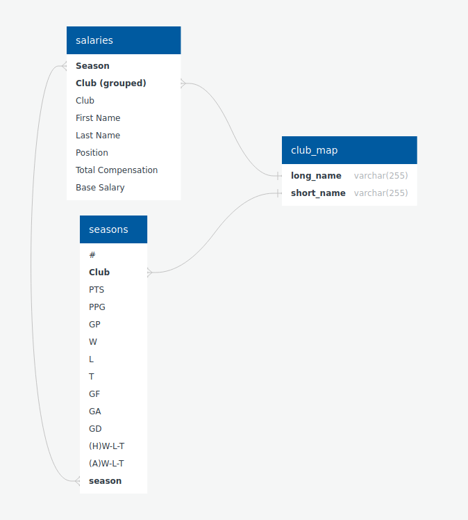

# UMN_PR02_ETL
## Project 2: ETL Challenge

This project was completed by Karim, Mikhail, Josh and Michael.

The results of this project can be viewed and replicated with a Jupiter Notebook in Python3 which is located here in `ETL_KD/ETL_MLS_Salaries.ipynb`

Also please refer to `ETL_KD/MLSstandingsKD.ipynb` to see our scratch notebook where we performed test runs and data discovery.

## EXTRACT

### 1. Data World

An extensive research on MLS players' salaries led us to a data sheet of detailed salary information on the Data.world website. The data is open to download in csv format.

### 2. MLS Soccer

The games stats per season can be found at MLSsoccer.com website, categorized by seasons. We pulled the data by iterating through seasons using Pandas, creating season-specific URLs that could then be scraped for that season's relevant data.

## TRANSFORM

Since we have data from different sources (Data.world & MLSsoccer.com), we realized we needed to join the two datasets using a mapping dictionary. The Salaries table refers to the soccer clubs by their abbreviations while the Seasons table uses full names of the clubs. Because there is only a couple of dozen clubs in MLS league the mapping table could easily be composed manually. All that was needed was a "Select" query on unique names and unique abbreviations from the two tables in order to match them together. See the "create table club_map" part in the notebook.

## LOAD

For storing data together for future analysis, an sqlite database was chosen as the most versatile database engine.

The database schema was defined [quickdatabasediagrams.com](https://app.quickdatabasediagrams.com) as follows:

## API

Run API/app.py to gain programmatical access to the data.

---
If you read this put word Zeus in the homework comment.

UMN_GroupProject_2 
Table of Contents
1. [ Motivation For Project. ](#motiv)
2. [ General Info. ](#Gen)
3. [ Building Status. ](#buildingstatus)
4. [ Framework Used. ](#framework)
 
## 1. Motivation for project

Does a team having higher level salaries equate to a more successful season?
 
## 2. General Info  

This project was completed by Karim, Mikhail, Josh and Michel.
 

## 3. Building Status
Utilizing Plotly and D3 we read in the API to create our plot that displayed the compensation analysis showing total compensation(Avg) as well as base salary(Avg) and on the timeline for each club.  
Utilizing Plotly, D3 and Chart.js we populated our dropdown list from the database.  This allowed the graph to be responsive to the dropdown list.  Our plot was a boxplot displaying player’s base salaries for a single season.  In addition there is a mini table summarizing the seasons salaries.  
 

## 3. Framework used
 
1.[Chart js](https://www.chartjs.org/)
 
2.[D3](https://d3js.org/)
 
3.[Plotly](https://plotly.com//)
 
4.[Heroku](https://signup.heroku.com/t/platform?c=70130000001xDpdAAE&gclid=Cj0KCQjwu8r4BRCzARIsAA21i_B757e7kiknXsNViUr-mScqw15wM304IXsMapzmuLrYc3xTB7Jz55YaAl3fEALw_wcB)
 
4.[SQLite](https://www.sqlite.org/index.html)
 
5.[SQLALchemy](https://www.sqlalchemy.org/)
 
6.[Pandas](https://pandas.pydata.org/)
 
 

If you read this, put the word Zeus in the homework comment.

